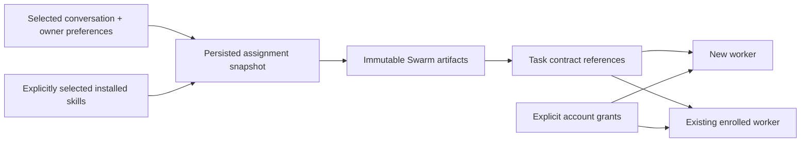

# Swarm host

Each operator conversation owns a stable Swarm actor and an independently fenced
session. The host mounts the actual Swarm MCP tools into Pi and admits leased
messages through the existing conversation queue. The model explicitly acknowledges
processing. Social conversations have no Swarm connection.

`SwarmHost.start` restores bindings; `extension` mounts tools; `settled` rechecks
the inbox after a turn; `close` closes clients. The coordinator retains durable
state under `CLANKIE_STATE/swarm` and outlives individual host clients.

`tools` supplies the same registrations to Pi and the operator MCP bank. The
native Claude seat uses its explicitly selected service conversation (the default
global conversation when omitted) through
Clankie's MCP server; its launch directory and inherited worker environment do
not select another actor. The owner's configured Herdr connections supply local
Claude dispatch routes, each with a capacity and an owned workspace for each
worker. The default route has capacity four. Uncertain starts retain their provisioning token and capacity
reservation. Herdr's native `layout.apply` API replaces only the new workspace's
initial tab with a direct argv worker process. Shell startup prompts cannot
consume its command. The worker publishes its actual pane ID in a private startup
receipt; binding also requires an authenticated runtime observation. A lost API
response is reconciled through that receipt and the same provisioning token.

`clankie swarm status`, `/swarm`, and operator-authenticated `GET /v1/swarm` expose
the coordinator's diagnostics. If no Herdr/Claude executable is available,
communication still works and provisioning reports unavailable. A native Claude
seat with the plugin channel enabled receives Swarm envelopes through the service's
existing seat outbox. Opening the channel rechecks pending inbox messages, including
before the first Pi turn. Owned stream workers also wake when idle. Owners and workers require a deliberate restart to load a
new runtime package; replacing files does not upgrade running processes.

The bundled skills are `lead`, `swarm-lead`, `herdr-lead`, and `swarm-mcp`.
Their sources live in the skills and Swarm repositories; distribution artifacts
and provenance are in [vendor](../../vendor/README.md). Architecture:
[ADR 0180](../../docs/adr/0180-swarm-is-the-coordination-layer.md).

## Connection contract status

[ADR 0181](../../docs/adr/0181-clankie-is-independent-of-his-connections.md)
defines the accepted product architecture. The current implementation includes
the embedded coordinator, per-conversation actors, bundled leadership skills,
named Herdr/Claude dispatch routes, explicit startup selection independent of the
launch terminal, and combined runtime/Swarm/account inventory in API, CLI and TUI.
The service runs without Herdr when disabled or when runtime startup fails.
Communication and task records remain available; unavailable Herdr routes cannot
provision new workers. Configured enrolled-peer routes remain eligible without
Herdr. Explicit runtime selection fails before creating or replaying a dispatch intent.
Existing coordinator state and workers remain intact. The running service keeps
a lost external connection unavailable instead of replacing its fleet. Gateway hosting routes to a configured host.
The [single-owner Linux deployment](../../infra/hosted/README.md) supplies the actual
captain, Swarm/Herdr worker environment and relay independently of an owner's desktop.

## Named external coordinators

`clankie swarm connect PRIVATE.json` verifies a dedicated enrolled Clankie session
at an existing coordinator. Settings retain its ID, actor, scope, owning
conversation and local endpoint; the broker retains the capability. The external
owner and its agents need no Herdr integration with Clankie. Local Unix sockets
and operator-managed SSH socket forwards use the same existing authenticated
transport; no network server or speculative transport framework is added.
[CLI setup](../../docs/cli.md#swarm-coordination) owns the import-file contract.

Each of the nine mounted tools accepts `connection: "id"`. The default is the
embedded coordinator. One conversation can lead several named connections, each
with its own actor/inbox and retained assignment instruction snapshots. A name
cannot redirect existing work to another endpoint, actor, scope or conversation.
Credentials and configured identity are rechecked before calls and wake admission;
connection loss never creates or selects another owner. Disconnect retains the
identity and work binding, closes local sessions and removes the capability.
Reconnecting the same identity can use a fresh enrolled session capability.

Worker grants retain the connection ID, including delivery, renewal, per-call
assignment checks, MCP session identity and tool-list notifications. Identical
scope names on separate coordinators are distinct authorities. An external worker
selects its existing connection with `CLANKIE_SWARM_CONNECTION` when running
`clankie mcp --swarm`. The external owner's launch configuration supplies any
worker MCP bridge; importing a connection does not modify that owner's routes.

Regression coverage uses two real independent owners with the same scope name,
a user-enrolled worker, immutable instructions, message wakes, restart, revocation
and no cross-coordinator task or grant access. The
[SSH proof](../../docs/testing/2026-09-23-swarm-integration/external-ssh-proof.json)
connects Clankie to an independent Linux coordinator through an authenticated
Unix-socket forward. A controlled remote worker reads doctrine, calls one
explicitly delegated synthetic provider tool through a reverse forward, and
loses access on revocation and disconnect. The external owner keeps its task.
SSH tunnel lifecycle and remote machine provisioning remain operator runtime
concerns; this proof uses no personal SSH keys or live provider credentials.

## Implementation sequence

Each slice has its own acceptance boundary. Existing state, conversation queues,
settings, credential broker and CLI commands are the starting points; a generic
plugin framework is not a prerequisite. Project tracking belongs in the existing
Clankie Linear project; this technical sequence is not a second issue queue.

| Order | Change and owning code                                                                                                                                | Acceptance                                                                                                                                                                                                                                                                                                                                                                       |
| ----- | ----------------------------------------------------------------------------------------------------------------------------------------------------- | -------------------------------------------------------------------------------------------------------------------------------------------------------------------------------------------------------------------------------------------------------------------------------------------------------------------------------------------------------------------------------- |
| 1     | Explicit startup selection in `apps/clankie/src/herdr-session.ts`; align settings, doctor and TUI wording                                             | The same saved selection resolves identically outside Herdr and inside two different sessions. A missing named session never adopts the invoking terminal. Existing bundled fallback stays visible in status.                                                                                                                                                                    |
| 2     | Optional execution in service startup, health and Herdr tool registration                                                                             | A service with no Herdr installed starts, talks through authorized portals and exchanges Swarm messages. Missing terminal/provisioning capabilities return an explicit unavailable result. Losing a runtime does not end conversations or move an uncertain assignment to another runtime.                                                                                       |
| 3     | Explicit runtime and coordinator connections in settings, `packages/swarm`, service API and CLI                                                       | Two runtime connections and two coordinator scopes retain independent identities through restart. A user-started agent joins a selected reachable scope. Route changes affect only new work, preserve existing intents and never recreate pending workers. Coordinator credentials stay broker-owned; unreachable or unauthorized scopes fail without fallback to another scope. |
| 4     | One connection inventory in API/CLI/TUI and the companion app                                                                                         | Views agree on configured versus active connections, agents, health and available operations. Selecting an agent routes to its actual runtime/scope; disconnecting a portal leaves workers alive. Native seats use the selected service conversation, independently of the caller's environment.                                                                                 |
| 5     | Linear automation identity, durable work-owner routing and precise webhook correlation in credential setup, `linear-webhook.ts` and the captain inbox | A human issue reply wakes the existing owner once, produces one bot-account reply and one intended Swarm action, including after restart/retry. Bot echoes, another worker's update and a human edit to the same issue remain distinguishable. Shared legacy credentials require explicit migration; display names confer no grants.                                             |
| 6     | Integrated operator flows and hosted execution packaging                                                                                              | Prove Discord + Linear operation end to end with Herdr/Swarm workers and retained issue evidence. Prove app-only work without Linear/Discord. Prove a hosted captain and worker environment without dependence on an owner's Mac, with tenant-isolated state, credentials and runtime connections.                                                                               |

Slices 1 and 2 cover launch environments, missing/disabled execution, runtime
loss, conversation access and Swarm communication without provisioning. Slice 3
includes named external coordinators and named Herdr execution connections.
`clankie runtime` pins execution IDs to sockets; `swarm_assign runtime` selects a
route independently of the coordinator's `connection` field. The owner reloads
route configuration per dispatch and retains original provisioning receipts.
Older owners require a deliberate upgrade before managed route changes.

Slice 4 has combined API/CLI/TUI inventory and companion-app Settings controls.
Terminal catalogs and input/observation reach named runtimes. Enrolled Swarm peers
are messageable personas through the existing conversation API, CLI/TUI and app;
[ADR 0182](../../docs/adr/0182-swarm-peers-are-messageable-personas.md) owns identity,
reply routing and restart semantics. Commons placement and shared channel rounds
still use execution seats. A [real multi-runtime check](../../docs/testing/2026-09-23-swarm-integration/real-runtime-proof.json)
verifies CLI and paired-device protocol inventory, isolated terminal input,
service restart, disconnect and reconnect across two actual Herdr servers.
Rendered app coverage uses the existing runtime fixtures.

[Runtime commands](../../docs/cli.md#connections-and-runtime) define configuration
and the shared-filesystem boundary for managed Herdr launches. Remote workers use
external Swarm coordinators. A [paired native-app proof](../../docs/testing/2026-09-23-swarm-integration/app-only-proof.json)
sends a coding request to an independent Claude worker, receives its verified result
and project-only doctrine marker, and restores the same reply after app restart.
This covers direct worker operation without Herdr, Linear or Discord. A
[native captain proof](../../docs/testing/2026-09-23-swarm-integration/README.md#native-captain-and-paired-app)
also delivers a conversation request to the interactive Claude plugin seat,
delegates a durable task to an existing worker and returns an independently
verified result. The [paired captain proof](../../docs/testing/2026-09-23-swarm-integration/README.md#native-captain-and-paired-app)
joins that flow to an iPhone request, an independently paired iPad and iPhone
relaunch, with settled native activity and completed tool indicators. The
[live Linear/Discord proof](../../docs/testing/2026-09-23-swarm-integration/README.md#live-human-reply-and-discord)
verifies a human issue comment reaching the existing owner, resuming its real
Swarm worker, publishing one bot result and answering the operator on Discord.

Linear has signed webhook admission, an opt-in inbox, precise revision receipts,
issue-owner routing and pending-wake recovery. Two independently enrolled workers
publish through the verified automation account in the
[live bot proof](../../docs/testing/2026-09-23-swarm-integration/README.md#linear-bot-account-and-two-workers).
The single-owner hosted coding
bundle runs independently of the gateway; managed tenant provisioning remains.

### Shared connected accounts (slices 3–5)

The product contract is connect once in Clankie, then delegate that connection to
authorized swarm workers. It applies to supported connected services generally,
with Linear as the first implementation. Workers invoke tools through Clankie;
the credential broker owns provider credentials and refresh. Worker grants bind
the selected connection/account, allowed operations and work scope, and remain
revocable. Swarm enrollment alone grants no connected-account access. Existing
room restrictions and provider permissions remain enforced.

The existing `apps/clankie/src/mcp-host.ts` already owns provider transports and
broker-backed credentials. `lane-mcp.ts` exposes a captain lane's complete tool
bank; its lane bearer is too broad to give to workers. Reuse the host below a
worker grant boundary, and reuse the broker's capability-token verification with
durable revocation and account binding. Enforce worker grants at list and call
time, including within an existing MCP session; bind each session to the worker
principal, not just a shared lane. The grant retains its trusted delegating lane;
a worker cannot select a more privileged lane in its request. Linear API-key setup verifies stable user/workspace IDs and displays the account
email. Existing API keys and MCP OAuth connections can be verified with
`clankie access linear verify`; grants bind to that verified account. See
[account verification](../../docs/worker-access.md#verify-the-account).
Linear OAuth refresh
uses the broker's cross-process `update` transaction: it rechecks the entry under
the mutation lock and serializes refresh with set/delete. Disconnect completes
after an admitted refresh, so the old refresh cannot restore a disconnected
account. Independent-process tests exercise concurrent refresh, disconnect and
replacement for both file storage and the Keychain path with a fake backend.
The broker and MCP transport boundaries are implemented. The host checks current
configuration and credentials on catalog reads and calls, replaces transports when
credentials change, and refuses missing credentials without curated fallback.
HTTP wire requests retain the selected credential snapshot; a pending old
connection cannot replace a newer one. Individual grants, exact tool/argument
restrictions, verified account binding and durable revocation are implemented in
`apps/clankie/src/worker-mcp.ts`. The operator API/`clankie access` CLI issues
private grants; `clankie mcp --grant FILE` serves the worker's tools without
operator channels or credentials. `/access` exposes account status, verification,
grant listing and revocation in the TUI. See [worker access](../../docs/worker-access.md).

This is explicit, short-lived delegation. A grant's optional `swarm` binding
resolves the enrolled worker, live task attempt and fence through the owning
conversation's authenticated coordinator connection. Only work created by that
conversation is eligible. The binding is checked on every request and tool call;
completion, cancellation, lost ownership and changed attempts stop access.
Opted-in renewable grants retain the same authority and grant ID while the
worker bridge refreshes short-lived tokens against that live binding. Revocation
invalidates every token; expired tokens cannot renew. Worker-initiated delivery
uses `clankie mcp --swarm-grant ID`: the service authenticates the runtime at the
grant's selected coordinator, checks actor/scope and the original work binding,
and returns only its existing authority. The grant ID can travel in a message;
bearers never do. No arbitrary coordinator endpoint is accepted from a worker.
New built-in Herdr workers receive a trusted `clankie_worker` MCP command. It
uses the enrolled scope/session, starts empty and receives tool-list change
notifications after explicit grant issuance/revocation. Scope selection resolves
only known service connections; each call rechecks grants and live ownership.
Existing owners/workers need a deliberate restart to load this configuration. `workId` is provenance, not implicit project isolation. Exact configured
argument values and forbidden argument keys enforce resource boundaries for selected tools. The connection inventory shows the
verified provider account; worker grants are listed separately by `clankie access list`.
Showing eligible workers beside the account remains an operator-UI gap. Apply the same contract
to subsequent supported connectors as they are integrated; do not prebuild an
adapter for every possible service. Clankie owns credential delegation and audit;
Swarm supplies worker identity and coordination, not copies of provider secrets.

Acceptance includes enforcing grants on every tool call, retaining worker and
connection provenance, surviving service restart without broadening access, and
revoking one worker without disconnecting others. Disconnecting the account blocks
all subsequent calls through that connection. Local and remote workers use the
same selected account without separate provider login; unsupported delegation is
explicitly unavailable. No raw provider credential is returned to workers, and
no missing connection falls back to another account.

### Linear first (slice 5)

Acceptance: two independently authenticated workers publish through one verified
automation account without separate Linear logins, while retaining their individual
Swarm actor provenance. Cover concurrent token refresh, restart, worker revocation,
unauthorized scope access and account disconnection. An unavailable or revoked
connection never falls back to the human's credentials. Verify the same behavior
for a worker reached outside Herdr; runtime placement does not select the account.

The dedicated Linear user is the initial account model. Linear's
[app identity](https://linear.app/developers/oauth-actor-authorization) is a separate
product option, not a prerequisite or an automatic replacement for that user.
Two-worker regression coverage exercises shared identity, call provenance,
session isolation, tool/argument refusal, expiry, revocation, restart and account
replacement/disconnect with synthetic credentials. Live provider writes are not established by those checks. Launcher tests cover
MCP configuration and scope propagation through response-loss reconciliation;
SDK bridge tests cover tool-list changes without reconnecting.

Shared-account delivery and verification:

1. Automatic MCP configuration is implemented for the built-in Herdr route.
   Enrolled external workers can use the same `clankie mcp --swarm` bridge.
   Issuance remains explicit; enrollment never grants connected-account access.
   The route receives only the bridge command and service URL, and the runtime
   supplies its own scope/session. The service checks all grants on every call.
   [Live Claude/Herdr proof](../../docs/testing/2026-09-23-swarm-integration/README.md)
   covers an initially empty connection, explicit grant, one synthetic provider
   call, revocation and fenced task completion without worker restart. The owned
   host renews live task leases independently of model turns. Native Claude
   leadership shares the selected service conversation's actor and can select
   additional named external coordinator connections. The SSH proof covers
   delegated access from an independently enrolled remote worker.
2. Renewal is implemented for opted-in assignment-bound grants. Regression checks
   keep an MCP session usable past its initial token expiry, preserve restrictions
   across restart and refuse renewal after revocation, ended work or account
   changes. The [real-worker renewal proof](../../docs/testing/2026-09-23-swarm-integration/README.md#renewable-access-in-a-real-worker)
   exercises automatic enrolled access beyond initial expiry and live revocation.
3. OAuth identity verification uses Linear's official MCP identity tools. The
   live bot proof verifies two independently enrolled workers writing through the
   intended account, issue restrictions, create-only comment access and independent
   revocation. Verification does not switch the authenticated user.
4. Durable inbox admission, explicit issue-owner routing and pending-wake recovery
   are implemented. The live Linear/Discord proof uses the intended human and bot
   accounts, one existing real worker, and an actual delivered Discord reply. Revision receipts cover
   structured, verified-account writes; unsupported or incomplete results remain
   visible rather than being guessed into an echo. External side effects require
   reconciliation after a process stops mid-turn; event deduplication alone cannot
   establish exactly-once provider writes.

### Working preferences and portable skills (slices 3–6)

The service's owner-authored persona/fleet preferences and the Claude seat's
startup context share the same source. `clankie seat --conversation ID` loads the
selected workspace's agent instructions through Pi's resource loader and starts
Claude in that workspace. Pi workspace conversations load its instructions and
skills. Native seat episode recall remains shared by operator lane. The Claude plugin
projects settled native messages/tools into the selected service conversation
through `clankie seat-sync`, independently of Herdr.

Every assignment through Clankie's Pi or native-seat Swarm tools pins a snapshot
of `persona.characterNotes`, `fleet.notes`, and the selected conversation's agent
instruction files. The same Pi resource loader supplies native seats and worker
snapshots. Each snapshot names its conversation, selected workspace, and source
files. The task's execution worktree does not select a different instruction
source; use the intended project's conversation before assigning work.

Snapshots are private service records under `swarm/instructions/`; their published
artifacts are visible to authenticated peers in that repository's coordination
scope, as other Swarm artifacts are. Separate projects use separate scopes;
conversations and worktrees of one repository are not privacy boundaries.
Do not put credentials in instruction files. `contract.instructions` holds ordered
immutable artifact references. Workers read them using `swarm_evidence` before
starting, whether dispatch spawns them or they are already enrolled elsewhere.
This carries preferences without making a worker Clankie or granting tool access.

Clankie's `swarm_assign` adds an optional `skills` array of installed catalog
names, for example `skills: ["lead", "project-review"]`. The operator conversation's
composer catalog and Pi sessions use the same skill roots and precedence. Only
explicitly selected skills are attached. Missing or disabled names fail before
dispatch. The host consumes this field; the coordinator receives ordinary
`contract.instructions` references.

A selected directory skill includes its entrypoint and supporting files, with
relative paths, SHA-256 hashes and executable flags. UTF-8 text remains readable;
binary assets use base64. The original source path is provenance, not a path the
worker must access. Workers can materialize the bundle into a fresh task-local
directory when scripts or assets are needed. Nothing is installed or executed
automatically, and existing skill installations are not overwritten. Host programs,
SSH connectivity and provider credentials remain separate prerequisites.

The catalog may link to a versioned skill directory outside the workspace. Once
that skill root is resolved, nested links must remain inside it; external links,
cycles, non-regular files and changed files fail capture. `.git` metadata is
excluded. A standalone markdown skill exports only that file, not its parent
directory. Selection shares the directory's authored files with the Swarm scope;
keep secrets in the credential broker. Up to 20 skills, 256 files and 256 KiB of
source bytes fit a selection, subject to the overall instruction snapshot limit.

Uncertain retries and explicit reassignments keep the snapshot for the original
work identity, including after host restart. New assignments read current
preferences. Reusing an identity for different work fails. Each UTF-8 text part
fits one verified read; the limit is 20 artifacts (at most 480 KiB of serialized
text, less when the caller supplies additional references). Oversize context
fails before dispatch; it is never silently truncated. Existing intents created
without snapshots retain Swarm's payload conflict protection; do not retry them
with altered contracts to retrofit preferences.

The hosted coding image includes Git/SSH and persistent owner/project skill roots.
Remote access still requires explicit owner configuration; personal machine names,
credentials and machine-specific skills remain outside product defaults. Acceptance includes two projects with
different styles, user customization, a Claude plugin seat, a spawned worker and
an enrolled agent outside Herdr.

Run `pnpm --filter @clankie/swarm test` for real MCP isolation, acknowledgment and
restart coverage. Swarm's own `coordination-herdr.test.ts` covers idempotent
provisioning, including uncertain launch reconciliation.
