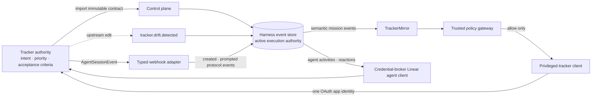

# @clankie/tracker-connector

Trusted control-plane mirror for tracker-authoritative mission contracts and
mission events. The interface is provider-neutral; `LinearTrackerClient` is
the first adapter over a narrow typed client.

Plan submission checks the imported contract; upstream edits produce drift
instead of rewriting it. Assignment follows the mission-engine lease. Every
write asks the trusted policy gateway, and the client port has no credential or
author override. Linear must use `actor=app`; member aliases are rejected.

## Linear app-agent contract

`CredentialBrokerLinearAgentClient` is the credential-free API used by trusted
runtime code. It provides typed `agentSession` and `agentSessions` queries,
`thought`, `response`, and `elicitation` agent activities through
`agentActivityCreate`, and issue/comment reactions through `reactionCreate`.
Session and activity results are rejected when their app user does not match
the configured Clankie app identity. Reaction inputs require exactly one
parent.

`CredentialBrokerLinearAgentRuntime` is the trusted control-plane port over that client. It reads every authoritative activity page before Eve receives context, rechecking workspace, app, session, issue, and exact requested root-comment binding on each page. Threads fail closed on missing or repeated cursors and when they exceed the protocol's 500-activity context bound. Agent-activity and reaction writes use deterministic UUIDs derived from delivery idempotency keys and reject results whose activity author, type, or exact body differs from the requested write. Issue comments use the existing trusted `TrackerClient` path after revalidating its app identity; that credential never enters the bridge.

`parseLinearAgentSessionEvent()` accepts a verified webhook body plus trusted
delivery context and the expected workspace app-user ID from the ingress layer.
It maps only `created` and `prompted` events into `DomainEvent` values and
preserves the Linear issue, root/source comment, triggering actor, app actor,
session, webhook, `Linear-Delivery`, and Clankie correlation identities.
Self-authored events, cross-issue comments, and identity disagreement fail
validation instead of producing an ambiguous event. Recorded fixtures cover
both event kinds, invalid actions, identity mismatch, and documented optional
context.

## OAuth and secret boundary

`LinearOAuthCredentialBroker` is the typed boundary between this package and
the VUH-689 credential broker. The human OAuth callback deposits its one-time
authorization code into the broker and passes only an opaque handle to
`exchangeAuthorizationCode()`. `refresh()` rotates the stored access/refresh
pair, and `executeGraphql()` loads credentials internally and returns only the
GraphQL operation's data. Exchange and refresh return a redacted status with
workspace, app-user, expiry, and scope metadata—never tokens.

The public agent client contains only an opaque credential ID, workspace ID,
and app-user ID. Client IDs, client secrets, authorization codes, access tokens,
refresh tokens, and authorization headers do not enter package configuration,
worker environments, logs, public client inputs, or public client results. The
credential-broker implementation owns token persistence, refresh retry, and
GraphQL authentication.

OAuth application creation, installation, `actor=app` authorization, and
credential insertion are owner operations outside this package.

## Live smoke

The lead/owner `test:live` smoke imports the trusted module named by
`CLANKIE_LINEAR_LIVE_CLIENT_MODULE`. The module exports `createLinearClient()`
for the tracker mirror and `createLinearAgentClient()` for the app-agent API.
The agent smoke uses a disposable session/issue and caller-supplied UUIDs from
`CLANKIE_LINEAR_LIVE_AGENT_SESSION_ID`, `CLANKIE_LINEAR_LIVE_ISSUE_ID`,
`CLANKIE_LINEAR_LIVE_ACTIVITY_ID`, and `CLANKIE_LINEAR_LIVE_REACTION_ID` so its
writes are repeatable. Normal worker gates leave both live-smoke flags unset,
so both live files are skipped.

## Tracker ceremony (issue drafts + human attention)

`validateIssueDraft` is a pure validator driven by `CaptainCeremonyProjection` (from
`@clankie/doctrine`). It enforces required product impact (including non-empty
`bodyMarkdown` when product impact is required), no prose before the first
heading, configurable heading/placement, and max summary sentences (HTML ` `
normalized so it cannot compress sentences) **before** any connector write.

`WorkspaceTrackerBinding` maps semantic target roles and notification surfaces to
**opaque principals** and provider-neutral capabilities. Provider-specific Linear
identity/assignment/mention configuration belongs only in Linear adapter/binding
fixtures — never in protocol, doctrine, or captain projection text.

`deliverHumanAttention` policy-evaluates every attempted action with a truthful
`TrackerWriteRequest` action (or marks the action `unsupported`). Store keys are
stable per `requestId`; the content fingerprint includes binding **and** request
fields so the same id with different ask/role/surfaces conflicts. Each adapter
`attempt` receives a stable `actionIdempotencyToken` (same on every retry) that
providers must use as their external idempotency key. Durable single-flight is a
store obligation (`AttentionDeliveryStore.durableSingleFlight`): production uses
event-store reserve + compare-and-append completion; an in-memory mutex is
process-local only and is **not** durable exactly-once. Aggregate outcomes remain
`delivered` | `partial` | `unsupported` | `fallback`. When
`directNotification=required`, a successful `direct_notify` is mandatory for
`delivered` — marker/comment-only bindings demote to `unsupported` or `fallback`,
never `delivered`. Per-action `denied` stays distinguishable from `unsupported`
even when the aggregate collapses to `unsupported`.

Control-plane correlate accepts only `requestId` + `verifiedEventId` (+ response
id / profile hash). Pending request context is loaded from the durable delivery
store (never caller-supplied). Actor role, decision, and rationale are derived
from the verified event (`attentionResponse` / typed fields), not the HTTP body.

`correlateAgentSessionToAttention` resolves pending attention only from verified
`tracker.agent-session.created` / `prompted` events. It requires
`pending.workspaceId === event.data.organization.id`, rejects events older than
`request.createdAt`, and matches root comments via event comment/root fields
(`comment.rootId` / `comment.id`, then session source/comment ids). Ordinary
out-of-session issue comments never resolve a request
(`correlateOutOfSessionIssueComment` is an explicit no-op).
