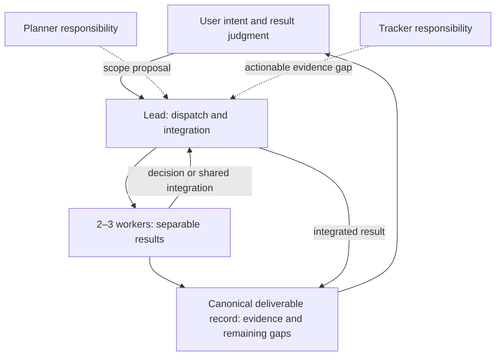

# Roles and reasoning effort

Start a bounded delivery with one lead who also integrates and two or three
workers owning separable results. This is a starting shape, not a permanent cap
or a reason to interrupt existing owners. Widen it after delivery exposes a
bottleneck that another worker can remove.

Planner and tracker are responsibilities, not required extra panes. Keep the
user's existing division of authority; Clankie can fill the lead role without
becoming another supervisor above it.

| Role | Owns | Useful wake |
| --- | --- | --- |
| Lead | Priorities, ownership conflicts, shared integration and delivery decisions | A decision or integration needs action |
| Planner | Bounded issues, dependencies and inspectable acceptance criteria | Intent changes, a dependency changes or the ready queue needs work |
| Tracker | Missing evidence, stale handoffs and claim/result discrepancies | New evidence or a delivery checkpoint needs reconciliation |
| Worker | Implementation, checks, capture and direct publication of an owned result | Work toward that deliverable |

Planner proposes work through the dispatcher. Tracker surfaces actionable gaps
to the owner; it is not a mandatory relay, a second verifier of every result or
another dispatch authority. Turnover and process recovery are bounded assignments,
not permanent reporting duties. End a role's turn when nothing needs judgment.



## Effort follows the task

These are starting defaults for the user's Astra swarm, not a measured optimum
or a mapping between different providers' effort scales. Verify supported settings
in the active harness. Explicit user settings take precedence.

| Work | Default effort | Escalation |
| --- | --- | --- |
| Lead | high | xhigh for difficult shared integration or consequential conflicting evidence |
| Planner | high | medium for routine queue maintenance; xhigh for a hard design/dependency problem |
| Tracker | medium | high for disputed evidence or complex retirement/process recovery |
| Implementation, art, modeling, mocap or capture | medium | high for difficult state, networking, deformation, transforms or pipeline diagnosis |
| Bounded technical review | high | xhigh for a reproduced difficult failure that remains unresolved |
| Mechanical uploads, links and captions on inspected evidence | low | medium when interpretation or reconciliation is needed |

**James's fleet default (2026-09-26):** builders and reviewers run Codex Astra at
high; research lanes run Astra medium in the `research` workspace. Use Opus high
only where the repository requires a reviewer from another model family, for
example code that drives a live surface or decides training or evaluation data
written by a Codex lane. Keep one idle cross-family reviewer rather than launching
new ones. A newly launched Codex pane may update itself and exit on its first
start; rerun the launcher.

Reserve xhigh/max for a named difficulty, not seniority or time spent waiting
for a render. Keep acceptance checks unchanged at every effort. After resolving
the difficult part, return to the routine default. Compare total tokens through
acceptance, usable artifacts, rework and missed defects over a wave.

Choose model tier from the consequence and judgment required, not patch size or
the presence of tests. Safety/security boundaries, training or evaluation data
integrity, live or hard-to-undo surfaces, and consequential concurrency or shared
integration require a top-capability model at high effort or above unless the user
explicitly chooses otherwise. This includes offline code that later controls those
surfaces, not just the agent operating them. Multi-part pipelines with ordinary
failure modes can use the middle tier. Reserve smaller models for mechanical or
narrowly specified work whose correctness can be checked independently and which
does not own those boundaries; research is not automatically low-judgment work.
Verify the actual configured pair rather than trusting a pane label or inherited
default. Judge the allocation by accepted results, rework and missed defects.

The owner's model mode, set beside the swarm size (see `lead`, "Size to the
owner's budget"), moves these defaults. Under `optimal` (the default) the table is
a floor: pick the stronger pair whenever the job could use it. Under `efficient` take
the smallest tier and lowest effort that meet each job's acceptance, and keep the
top model only on the consequential boundaries above.

Choose model and effort together as one (model, effort) pair at launch. An unset
effort inherits the user's per-model default, which can be the maximum. More effort
does not substitute for model capability. When a lane struggles, check scope,
model fit and concrete progress first; raise effort only if the model already fits
the responsibility. Do not leave an unsuitable smaller model on consequential work
because it is already running at maximum effort. On a live surface effort is also
a latency knob.

The pair belongs to the assignment, not the pane. Re-check it whenever a pane is
given different work: a pane launched small for bounded code does not become the
right owner of safety-critical or concurrency-heavy work because it is idle and
knows the files. Start a fresh pane at the right pair and hand the files over
explicitly. The same goes for a pane that has run one turn for an hour or sits at
its context limit with messages queued: queued prompts are not read mid-turn, so
interrupt it, take a written handoff note, and move the work.

Configure the actual harness; prose asking for an effort is not a setting. Set
both at launch, where the override is scoped to that pane:

```bash
herdr agent start worker --kind codex --pane <available-pane> -- -c 'model_reasoning_effort="medium"'
herdr agent start worker --kind claude --pane <available-pane> -- --model sonnet --effort medium --permission-mode auto
```

For an existing pane, use its supported configuration path at a safe turn boundary
and verify the resulting setting; do not interrupt active work or claim a queued
request changed it. Check the scope: Codex's `/model` picker can persist global
defaults, and Claude Code's `/model <name>` always does: it answers "saved as your
default for new sessions" and rewrites `"model"` in `~/.claude/settings.json` (the
dotfiles file), so every later pane and the user's own sessions start on the
worker's tier. If a running Claude pane must change, restore that line afterwards
and confirm with `git -C ~/dotfiles diff -- claude/settings.json`. Treat `/effort`
the same way: it writes the per-model default in `modelSettings`. Label each pane
with its role, model and effort (`herdr pane rename`) and keep the label current,
so the user can audit the fleet at a glance. Codex's
next-turn settings API requires a reachable app-server endpoint.
Clankie's `fleet` notes express routing preferences; they do
not configure workers. Its service effort setting governs its own captain, not
external Codex or Claude seats. Inspect `clankie help` and current settings before
changing either. Do not change a user's global model default to tune one swarm.
